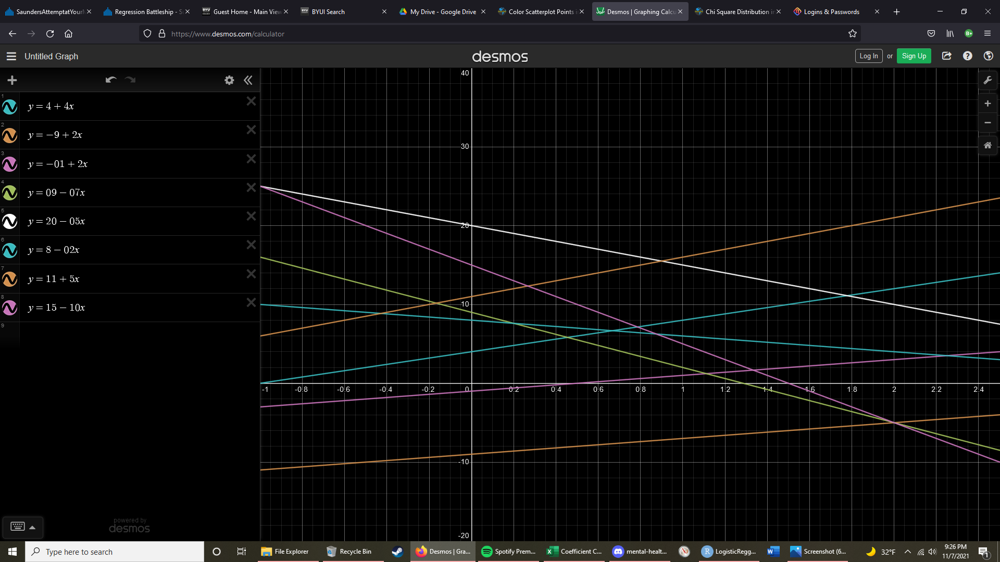

```{r message=FALSE, warning=FALSE}
library(pander)
library(tidyverse)
```

# {.tabset .tabset-pills}

## Instructions 

Using [Desmos](https://www.desmos.com/calculator), design a "true linear regression model" that is **2D-Drawable**, and follows all other **Regression Battleship Rules** (listed below), that is of the form 

$$
  Y_i = \beta_0 + \underbrace{\quad\quad\quad\ldots\quad\quad\quad}_\text{Your Model Goes Here} + \epsilon_i \quad \text{where} \ \epsilon_i \sim N(0, \sigma^2)
$$ 

Then, use a simulation in R and your linear regression model to obtain a sample of data saved as `rbdata.csv`. 

Your sample of data will be given to other students and your teacher, but this Rmd file (which contains the secret on how you made your data) will remain hidden until after the competition is complete. Your teacher and two of your peers will use the sample of data your provide, `rbdata.csv`, to try to **guess** the **true linear regression model** you used to create the data. The goal is to hide your model well enough that no one can find it.

### Official Rules {.tabset}

#### Advanced Level Competition

Competing in the *Advanced Level* will allow you the opportunity to earn full credit on the Regression Battleship portion of your grade in Math 425 (which is 15% of your Final Grade). However, if you compete at this level, you cannot ever discuss your model with your teacher. You can however still ask for help from the TA's or other students that you are not competing against. And you can ask "vague" questions to your teacher as long as it doesn't give too much away about your model.

There are five official rules your model must abide by. If you break any of the rules, you will be disqualified from winning the competition and a grade penalty will result.

1. Your csv file `rbdata.csv` must contain **11 columns of data**.
    * The first column must be your (1) y-variable (labeled as `y`).
    * The other ten columns must be (10) x-variables (labeled as `x1`, `x2`, ... , `x10`). *Please use all lower-case letters.* It does not matter which x-variables you use in your model, and you don't need to use all 10 x-variables in your model.
   
<br/>
    
2. Your **y-variable** (or some transformation of the y-variable) must have been **created from a linear regression model** using only x-variables (or transformations of those x-variables) **from** within **your data set**.
    * Be very careful with transformations. You must ensure that you do not break the rules of a linear regression if you choose to use transformations.
    * If you choose transformations, only these functions are allowed when transforming X and Y variables: `1/Y^2`, `1/Y`, `log(Y)`, `sqrt(Y)`, `sqrt(sqrt(Y))`, `Y^2`, `Y^3`, `1/X^2`, `1/X`, `log(X)`, `sqrt(X)`, `sqrt(sqrt(X))`, `X^2`, `X^3`, `X^4`, and `X^5`. Don't forget to check Rule #3 carefully if you choose transformations.

<br/>
    
3. Your **sample size** must be sufficiently large so that when the true model is fit to your data using lm(...), **all p-values** of terms found in the `summary(...)` output **are significant**.

4. The $R^2$ value ("Multiple R-squared", not the "Adjusted R-squared") of your true model fit on your `rbdata` sample must be greater than or equal to $0.30$.

5. Your true model must be **2D-drawable**. This means that it can be drawn in Desmos and with a 2D scatterplot in R.

<br/>
<br/>


#### Beginner Level Competition

Competing in the *Beginner Level* will **only** allow you to earn **up to 85%** of the full credit that is possible on the Regression Battleship portion of your grade in Math 425 (which is 15% of your Final Grade). *However, getting 85% of the grade is **better than failing** the advanced level competition and getting 0% of the Regression Battleship grade.* So choose this option if you are not feeling comfortable with your abilities to compete at the Advanced Level. The good news is that if you choose this option, your teacher can help you with your model to make sure everything is correct before you turn it in.

For the beginner level competition, there are also five official rules your model must abide by. If you break any of the rules, you will be disqualified from winning the beginner competition and a point penalty will be applied to your grade.

1. Your csv file `rbdata.csv` must contain **6 columns of data**.
    * The first column must be your (1) y-variable (labeled as `y`).
    * The other five columns must be (5) x-variables (labeled as `x1`, `x2`, `x3`, `x4` , `x5`). *Please use all lower-case letters.* It does not matter which x-variables you use in your model, and you don't need to use all 5 x-variables in your model.
   
<br/>
    
2. Your **y-variable** must have been **created from a linear regression model** using only x-variables **from** within **your data set**.
    * No transformations of y-variables or x-variables are allowed in the beginner competition.

<br/>
    
3. Your **sample size** must be sufficiently large so that when the true model is fit to your data using lm(...), **all p-values** of terms found in the `summary(...)` output **are significant**.

4. The $R^2$ value ("Multiple R-squared", not the "Adjusted R-squared") of your true model fit on your `rbdata` sample must be greater than or equal to $0.80$.

5. Your true model must be **2D-drawable**. This means that it can be drawn in Desmos and with a 2D scatterplot in R.

<br/>
<br/>


## Desmos 

Start by creating a picture of your true model in Desmos. Snip a screenshot of your completed model. Include a picture of your Desmos graph showing your true model.


 


## Code

Use the R-chunks below to create your simulated sample of data from your true regression model.


```{r}
set.seed(61) #This ensures the randomness is the "same" everytime if you play the entire R-chunk as one entire piece of code. If you run lines separately, your data might not come out the same every time. You can pick any integer value you want for set.seed. Each choice produces a different sample, so you might want to play around with a few different choices.

## To begin, decide on your sample size. (You may have to revise it later to ensure all values in your lm(...) are significant.)
  
 n <- 70

 startDomain <- -1
 endDomain <- 2.5
## Then, create 10 X-variables using functions like rnorm(n, mean, sd), rchisq(n, df), rf(n, df1, df2), rt(n, df), rbeta(n, a, b), runif(n, a, b) or sample(c(1,0), n, replace=TRUE)... ## To see what any of these functions do, run codes like hist(rchisq(n, 3)). These functions are simply allowing you to get a random sample of x-values. But the way you choose your x-values can have quite an impact on what the final scatterplot of the data will look like.

 x1 <- runif(n,startDomain,endDomain) #Dummy
 x2 <- sample(c(0,1), n, replace=T) #Dummy
 x3 <- sample(c(0,1), n, replace=T) #On Off switch #3
 x4 <- sample(c(0,1), n, replace=T) #dummy
 x5 <- sample(c(0,1), n, replace=T) #on off switch #1
 #x6 <- x4+runif(n,-4,4) #NOT LEGAL. x4 actually used in model. no longer 2d drawable
 x6 <- x2+x4+runif(n,startDomain,endDomain)#Dummy
 x7 <- runif(n,startDomain,endDomain) #Explanitory variable
 x8 <- runif(n,startDomain,endDomain)#dummy
 x9 <- sample(c(0,1), n, replace=T)#On Off switch #2
 x10 <- x4+runif(n,startDomain,endDomain) #dummy
 
 #sample(c(0,1), n, replace=T, prob = c(.3,.7))
## Then, create betas, sigma, normal error terms and y
 
 # *** WRITE IT DOWN BEFORE TYPING IT***
 #x7
 beta0 <- 4
 beta1 <- 4
 
 #x5
 beta2 <- -13
 #x5:x7
 beta3 <- -2 # not significant
 
 #x9
 beta4 <- -5
 #x9:x7
 beta5 <- -02 #not significant
 
 #x3
 beta6 <- 5 #not significant
 #x3:x7
 beta7 <- -11
 
 #x5:x9
 beta8 <- 34
 #x5:x9:x7
 beta9 <- -5
 
 #x5:x3
 beta10 <- 12
 #x5:x3:x7
 beta11 <- 7 
 
 #x9:x3
 beta12 <- 7
 #x9:x3:x7
 beta13 <- 14
 
 #x5:x9:x3
 beta14 <- -17
 #x5:x9:x3:x7
 beta15 <- -8 #not significant
 #...
 
 sigma <-3#change to whatever positive number you want
 

 ################################
 # You ARE NOT ALLOWED to change this part:
 epsilon_i <- rnorm(n, 0, sigma)
 ################################ 
 
 #An example of how to make Y...
 # y <-  beta0 + beta1*X1 + beta2*X2 + beta3*X4*X2 + epsilon_i
 #switches (in order) x5,x9,x3
 y <- beta0+beta1*x7+
   #single interaction
   beta2*x5+#beta3*x5*x7+
   beta4*x9+#beta5*x9*x7+
   #beta6*x3+
   beta7*x3*x7+
   #double Interaction
   beta8*x5*x9+beta9*x5*x9*x7+
   beta10*x5*x3+beta11*x5*x3*x7+
   beta12*x9*x3+beta13*x9*x3*x7+
   #triple interaction
   beta14*x5*x9*x3+#beta15*x5*x9*x3*x7+
   epsilon_i#...edit this code and replace it with your model. Don't forget the + epsilon_i!
 
 
 ## Now, you need to load your x-variables and y-variable 
 ## into a data set.
 # You can include Y' or X' instead of Y or X if you wish.
 # Remember, only these functions are allowed when transforming
 # variables: 1/Y^2, 1/Y, log(Y), sqrt(Y), sqrt(sqrt(Y)), Y^2, Y^3, 1/X^2, 1/X, log(X), sqrt(X), sqrt(sqrt(X)), X^2, X^3, X^4, X^5. 
 #########################################################
 # ILLEGAL: Y = (beta0 + beta1*X5)^2 + epsilon_i #########
 #########################################################
 # Legal: sqrt(Y) = beta0 + beta1*X5^2 + epsilon_i #######
 #########################################################
 # You can only transform individual terms, not groups of terms.
 # And the beta's cannot be part of the x-transformations.

 # This loads your data into a data set:
 rbdata <- data.frame(y, x1, x2, x3, x4, x5, x6, x7, x8, x9, x10)
 #View(rbdata)
 pairs(rbdata)
 #Now fit your model to make sure it comes out significant:
 mylm <- lm(y ~ x7+
              x5+#x7:x5+
              x9+#x7:x9+
              #x3+
              x7:x3+
              x5:x9+x7:x5:x9+
              x5:x3+x7:x5:x3+
              x9:x3+x7:x9:x3+
              x5:x9:x3,#+x7:x5:x9:x3,
            data=rbdata) #edit this code to be your true model
 
 summary(mylm) %>% pander()
 #all p-values must be significant
 #the R^2 value must be greater than or equal to 0.30.
 

# Once you are done with creating your model, and have successfully
# graphed it (see below), un-comment the following `write.csv` code,
# then, PLAY this ENTIRE R-chunk to write your data to a csv.

  #write.csv(rbdata, "rbdata.csv", row.names=FALSE)

# The above code writes the dataset to your "current directory"
# To see where that is, use: getwd() in your Console.
# Find the rbdata.csv data set and upload it to I-Learn.
```


## R Plot

Provide a 2D scatterplot that shows both your *true* model (dashed lines) and *estimated* model (solid lines) on the same scatterplot. This should match your Desmos graph. 

```{r}
#for multiple on off switches
#col = interaction (x4,...)
b <- coef(mylm)
palette(c("skyblue","skyblue4","orange","orangered", "firebrick", "firebrick4", "green", "limegreen"))
plot(y~x7, data=rbdata, pch = 16 , col = interaction(factor(rbdata$x5),factor(rbdata$x9),factor(rbdata$x3)))

#estimates
abline(b[1],b[2], col = palette()[1], lty=2)#X5=0,X9=0,X3=0
abline(b[1]+b[3],b[2], col = palette()[2], lty=2)#X5=1,X9=0,X3=0
abline(b[1]+b[4],b[2], col = palette()[3], lty=2)#X5=0,X9=1,X3=0
abline(b[1],b[2]+b[5], col = palette()[5], lty=2)#X5=0,X9=0,X3=1
abline(b[1]+b[3]+b[4]+b[6],b[2]+b[9], col = palette()[4], lty=2)#X5=1,X9=1,X3=0
abline(b[1]+b[3]+b[7],b[2]+b[5], col = palette()[6], lty=2)#X5=1,X9=0,X3=1
abline(b[1]+b[4]+b[8],b[2]+b[5]+b[11], col = palette()[7], lty=2)#X5=0,X9=1,X3=1
abline(b[1]+b[3]+b[4]+b[6]+b[7]+b[8]+b[12],b[2]+b[5]+b[9]+b[10]+b[11], col = palette()[8], lty=2)#X5=1,X9=1,X3=1

#estimates
abline(beta0,beta1, col = palette()[1], lty=1)#X5=0,X9=0,X3=0
abline(beta0+beta2,beta1, col = palette()[2], lty=1)#X5=1,X9=0,X3=0
abline(beta0+beta4,beta1, col = palette()[3], lty=1)#X5=0,X9=1,X3=0
abline(beta0,beta1+beta7, col = palette()[5], lty=1)#X5=0,X9=0,X3=1
abline(beta0+beta2+beta4+beta8,beta1+beta9, col = palette()[4], lty=1)#X5=1,X9=1,X3=0
abline(beta0+beta2+beta10,beta1+beta7, col = palette()[6], lty=1)#X5=1,X9=0,X3=1
abline(beta0+beta4+beta12,beta1+beta7+beta13, col = palette()[7], lty=1)#X5=0,X9=1,X3=1
abline(beta0+beta2+beta4+beta8+beta10+beta12+beta14,beta1+beta7+beta9+beta11+beta13, col = palette()[8], lty=1)#X5=1,X9=1,X3=1
#'''

```


## Math Model

Write out your "true" model in mathematical form. Make sure it matches your code. This could be "painful" if you chose a complicated model.

$$
  \ Y_i = \beta_0 + \beta_1 X_{7i} + \beta_2 X_{5i} + \beta_3 X_{9i} + \beta_4 X_{7i} X_{3i} 
   + \beta_5 X_{5i} X_{9i}  + \beta_6 X_{5i} X_{9i} X_{7i}  + \beta_7 X_{5i} X_{3i}  + \beta_8 X_{5i} X_{3i} X_{7i}  + 
   \beta_{9} X_{9i} X_{3i} + \beta_{10} X_{9i} X_{3i} X_{7i} + \beta_{11} X_{5i} X_{9i} X_{3i}
  + \epsilon_i
$$


## Results

Once the Regression Battleship competition is completed, you will be given instructions on how to complete this section. The basic idea is to compare the three guesses at your true model (from two peers, and your teacher) to decide who won (i.e., who had the closest guess).

```{r}
set.seed(84) #This ensures the randomness is the "same" everytime if you play the entire R-chunk as one entire piece of code. If you run lines separately, your data might not come out the same every time. You can pick any integer value you want for set.seed. Each choice produces a different sample, so you might want to play around with a few different choices.

## To begin, decide on your sample size. (You may have to revise it later to ensure all values in your lm(...) are significant.)
  
 n <- 70

 startDomain <- -1
 endDomain <- 2.5
## Then, create 10 X-variables using functions like rnorm(n, mean, sd), rchisq(n, df), rf(n, df1, df2), rt(n, df), rbeta(n, a, b), runif(n, a, b) or sample(c(1,0), n, replace=TRUE)... ## To see what any of these functions do, run codes like hist(rchisq(n, 3)). These functions are simply allowing you to get a random sample of x-values. But the way you choose your x-values can have quite an impact on what the final scatterplot of the data will look like.

 x1 <- runif(n,startDomain,endDomain) #Dummy
 x2 <- sample(c(0,1), n, replace=T) #Dummy
 x3 <- sample(c(0,1), n, replace=T) #On Off switch #3
 x4 <- sample(c(0,1), n, replace=T) #dummy
 x5 <- sample(c(0,1), n, replace=T) #on off switch #1
 #x6 <- x4+runif(n,-4,4) #NOT LEGAL. x4 actually used in model. no longer 2d drawable
 x6 <- x2+x4+runif(n,startDomain,endDomain)#Dummy
 x7 <- runif(n,startDomain,endDomain) #Explanitory variable
 x8 <- runif(n,startDomain,endDomain)#dummy
 x9 <- sample(c(0,1), n, replace=T)#On Off switch #2
 x10 <- x4+runif(n,startDomain,endDomain) #dummy
 
 #sample(c(0,1), n, replace=T, prob = c(.3,.7))
## Then, create betas, sigma, normal error terms and y
 
 # *** WRITE IT DOWN BEFORE TYPING IT***
 #x7
 beta0 <- 4
 beta1 <- 4
 
 #x5
 beta2 <- -13
 #x5:x7
 beta3 <- -2 # not significant
 
 #x9
 beta4 <- -5
 #x9:x7
 beta5 <- -02 #not significant
 
 #x3
 beta6 <- 5 #not significant
 #x3:x7
 beta7 <- -11
 
 #x5:x9
 beta8 <- 34
 #x5:x9:x7
 beta9 <- -5
 
 #x5:x3
 beta10 <- 12
 #x5:x3:x7
 beta11 <- 7 
 
 #x9:x3
 beta12 <- 7
 #x9:x3:x7
 beta13 <- 14
 
 #x5:x9:x3
 beta14 <- -17
 #x5:x9:x3:x7
 beta15 <- -8 #not significant
 #...
 
 sigma <-3#change to whatever positive number you want
 

 ################################
 # You ARE NOT ALLOWED to change this part:
 epsilon_i <- rnorm(n, 0, sigma)
 ################################ 
 
 #An example of how to make Y...
 # y <-  beta0 + beta1*X1 + beta2*X2 + beta3*X4*X2 + epsilon_i
 #switches (in order) x5,x9,x3
 y <- beta0+beta1*x7+
   #single interaction
   beta2*x5+#beta3*x5*x7+
   beta4*x9+#beta5*x9*x7+
   #beta6*x3+
   beta7*x3*x7+
   #double Interaction
   beta8*x5*x9+beta9*x5*x9*x7+
   beta10*x5*x3+beta11*x5*x3*x7+
   beta12*x9*x3+beta13*x9*x3*x7+
   #triple interaction
   beta14*x5*x9*x3+#beta15*x5*x9*x3*x7+
   epsilon_i#...edit this code and replace it with your model. Don't forget the + epsilon_i!
 
```


```{r}
 # This loads your data into a data set:
 rbdata2 <- data.frame(y, x1, x2, x3, x4, x5, x6, x7, x8, x9, x10)

mylm <- lm(y ~ x7+ x5+#x7:x5+
              x9+#x7:x9+
              #x3+
              x7:x3+
              x5:x9+x7:x5:x9+
              x5:x3+x7:x5:x3+
              x9:x3+x7:x9:x3+
              x5:x9:x3,#+x7:x5:x9:x3,
            data=rbdata2)
 #todo
 cody.lm <- lm(y~x9:x5+x5:x6+x6:x5+x3:x9:x7+
                 x3:x5:x6+x3:x7+x3+x5:x7:x3+
                 x7:x9:x5:x3+x7+x7:x9, data=rbdata2)
 #todo
 david.lm <- lm(y~ x7 +  x5 + x9:x5+ x3:x7 + x5:x3 + x5:x3:x7+ 
                  x9:x3:x7 + x9:x5:x3 + x9:x7,data = rbdata2)
 
 saunders.lm <- lm( y ~ x7 + x5  +  
                      x3:x7 +x9:x5 + x5:x3 + x9:x7 + 
                      x5:x7 +   x9:x5:x3 + x9:x3:x7 + 
                      x5:x3:x7 + x9:x5:x3:x7+ x3, data = rbdata2)
 #backup, do not touch
 saunders.lm <- lm( y ~ x5 + x3 + x7 + x9:x5 + x5:x3 + x9:x7 + 
                      x5:x7 +  x3:x7 + x9:x5:x3 + x9:x3:x7 + 
                      x5:x3:x7 + x9:x5:x3:x7, data = rbdata2)
 
  yhc <- predict(cody.lm, newdata=rbdata2)
  yhs <- predict(saunders.lm, newdata=rbdata2)
  yhd <- predict(david.lm, newdata=rbdata2)
  yhActual <- predict(mylm, newdata=rbdata2)
  # Compute y-bar
  ybar <- mean(rbdata2$y) #Yi is given by Ynew from the new sample of data
  
  # Compute SSTO
  SSTO <- sum( (rbdata2$y - ybar)^2 )
  
  SSEc <- sum( (rbdata2$y - yhc)^2 )
  SSEs <- sum( (rbdata2$y - yhs)^2 )
  SSEd <- sum( (rbdata2$y - yhd)^2 )
  SSEactual <- sum( (rbdata2$y - yhActual)^2 )
  
  rsc <- 1 - SSEc/SSTO
  rss <- 1 - SSEs/SSTO
  rsd <- 1 - SSEd/SSTO
  rsActual <- SSEactual/SSTO
  
  n <- length(rbdata2$y) #sample size
  pc <- length(coef(cody.lm)) #num. parameters in model
  ps <- length(coef(saunders.lm)) #num. parameters in model
  pd <- length(coef(david.lm)) #num. parameters in model
  pActual <- length(coef(mylm))
  rsca <- 1 - (n-1)/(n-pc)*SSEc/SSTO
  rssa <- 1 - (n-1)/(n-ps)*SSEs/SSTO
  rsda <- 1 - (n-1)/(n-pd)*SSEd/SSTO
  rsAa <- 1 - (n-1)/(n-pActual)*SSEactual/SSTO
 
  
  my_output_table2 <- data.frame(Model = c("Actual","Cody", "Saunders", "David"), `Original R2` = c(summary(mylm)$r.squared,summary(cody.lm)$r.squared, summary(saunders.lm)$r.squared, summary(david.lm)$r.squared), `Orig. Adj. R-squared` = c(summary(mylm)$adj.r.squared,summary(cody.lm)$adj.r.squared, summary(saunders.lm)$adj.r.squared, summary(david.lm)$adj.r.squared), `Validation R-squared` = c(rsActual,rsc, rss, rsd), `Validation Adj. R^2` = c(rsAa,rsca, rssa, rsda))
  
  colnames(my_output_table2) <- c("Model", "Original $R^2$", "Original Adj. $R^2$", "Validation $R^2$", "Validation Adj. $R^2$")

  
knitr::kable(my_output_table2, escape=TRUE, digits=4)

```

 

 